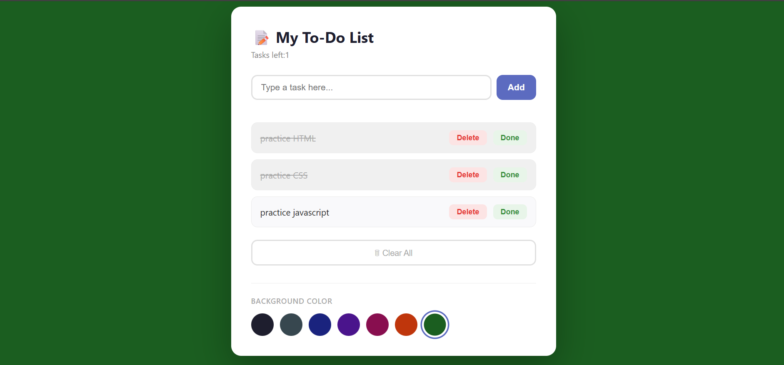

#  TO-DO LIST

A simple and responsive **To-Do List** web application built using **HTML, CSS, and JavaScript**. This project allows users to create and manage their daily tasks in a simple and user-friendly interface.

##  About the Project

This project was created to strengthen my JavaScript skills while improving my understanding of how HTML, CSS, and JavaScript work together to build interactive web applications.

##  Features

- Add new tasks
- Mark tasks as completed
- Delete tasks
- Clean and responsive user interface
- Beginner-friendly code structure

##  Technologies Used

- HTML
- CSS
- JavaScript

##  Project Structure

```text
TO-DO-LIST/
│── image.png
│── index.html
│── style.css
│── script.js
│── README.md
```

##  Getting Started

1. Clone the repository:

```bash
git clone https://github.com/sifen-Tech/TO-DO-LIST.git
```

2. Navigate to the project folder:

```bash
cd TO-DO-LIST
```


##  Preview



##  What I Practiced

- Manipulating the DOM with JavaScript
- Handling user events
- Writing reusable JavaScript functions
- Combining HTML, CSS, and JavaScript to build an interactive application
- Organizing project files for better readability

##  Author

**Sifen Beyan**

GitHub: https://github.com/sifen-Tech

