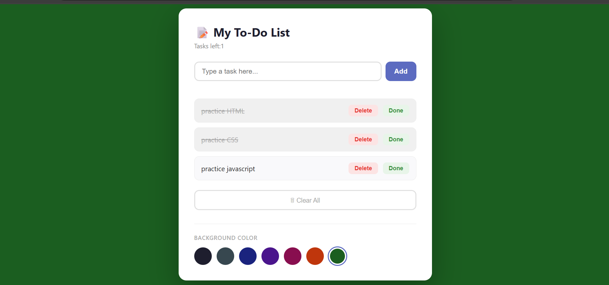

   ** TO-DO LIST**
A simple and responsive **To-Do List** web application built using **HTML, CSS, and JavaScript**. This project allows users to create and manage their daily tasks in a simple and user-friendly interface.

      **About the Project**

This project was created to strengthen my JavaScript skills while also improving my understanding of how HTML, CSS, and JavaScript work together to build interactive web applications.

    **Features**

- Add new tasks
- Mark tasks as completed
- Delete tasks
- Clean and responsive user interface
- Beginner-friendly code structure

   ** Technologies Used**

- HTML5
- CSS3
- JavaScript 

     **Project Structure**


TO-DO-LIST
|___image-3.png

│── index.html

│── style.css

│── script.js

│── README.md


   ** Getting Started**

1. Clone this repository:

   bash
git clone https://github.com/sifen-Tech/TO-DO-LIST.git
```

2. Navigate to the project folder:

  bash
cd TO-DO-LIST


3. Open the project by opening **index.html** in your web browser.

  ** Preview**



  ** What I Practiced**

Through this project, I practiced:

- Manipulating the DOM with JavaScript
- Handling user events
- Writing reusable JavaScript functions
- Combining HTML, CSS, and JavaScript to build an interactive application
- Organizing project files for better readability

    ** Author**

**Sifen Beyan**

GitHub: https://github.com/sifen-Tech
